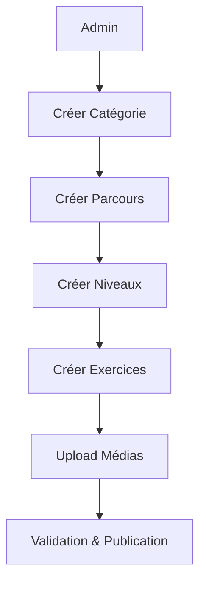
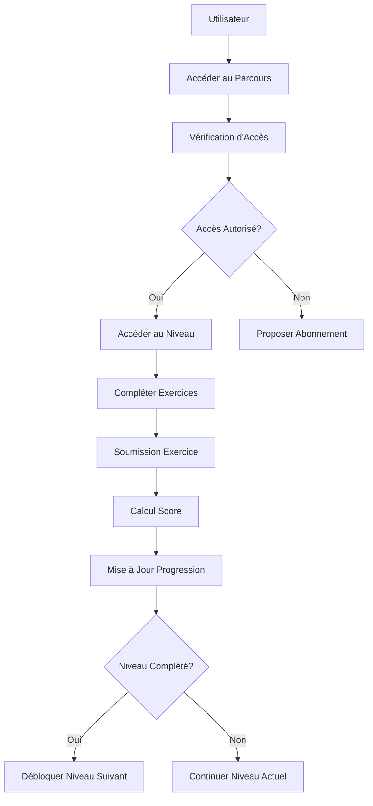
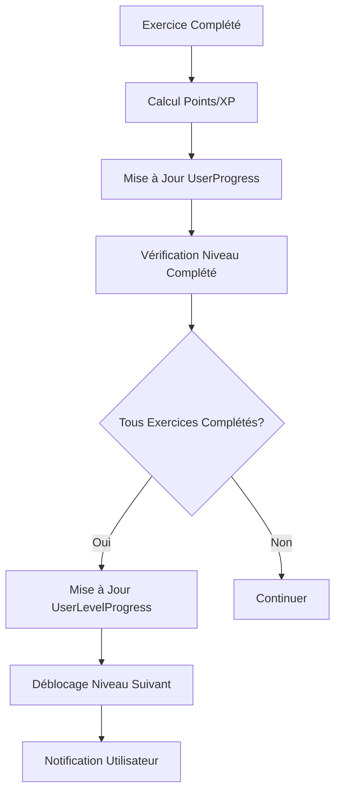

# Analyse Complète du Système de Cours

## 📋 Résumé Exécutif

Le système de cours de CodeGenesis présente une architecture sophistiquée avec une gestion multilingue complète, un système d'exercices avancé et une logique de progression bien structurée. L'analyse révèle des points forts dans la flexibilité des exercices et la gestion des médias, mais aussi des opportunités d'optimisation significatives.

## 🏗️ Architecture Actuelle

### 1. Modèles de Données

#### **Category.js** - Gestion des Catégories
- **Points Forts** :
  - Support multilingue complet (FR, EN, AR)
  - Types de catégories (classic, specific)
  - Index unique pour éviter les doublons
  - Gestion de l'ordre d'affichage

- **Points d'Amélioration** :
  - Manque de métadonnées (description, icône, couleur)
  - Pas de gestion des catégories parentes/enfantes
  - Absence de validation des traductions

#### **Path.js** - Gestion des Parcours
- **Points Forts** :
  - Structure simple et claire
  - Support multilingue
  - Référence vers les catégories
  - Gestion des niveaux intégrée

- **Points d'Amélioration** :
  - Manque de métadonnées (difficulté, durée estimée)
  - Pas de prérequis entre parcours
  - Absence de gestion des tags/mots-clés

#### **Level.js** - Gestion des Niveaux
- **Points Forts** :
  - Support multilingue complet
  - Gestion des médias (vidéos, PDFs) par langue
  - Référence vers les exercices
  - Ordre des niveaux

- **Points d'Amélioration** :
  - Manque de métadonnées (durée, difficulté)
  - Pas de gestion des prérequis entre niveaux
  - Absence de validation des médias

#### **Exercise.js** - Gestion des Exercices
- **Points Forts** :
  - **Système d'exercices très avancé** avec 20+ types
  - Support multilingue complet
  - Validation sophistiquée par type
  - Gestion des points et difficulté
  - Support des cas de test pour le code
  - Types spécialisés pour l'algorithmique

- **Types d'Exercices Supportés** :
  - **Classiques** : QCM, DragDrop, TextInput, Code, OrderBlocks
  - **Algorithmiques** : Algorithm, FlowChart, Trace, Debug, CodeCompletion
  - **Avancés** : PseudoCode, Complexity, DataStructure, ScratchBlocks
  - **Spécialisés** : VisualProgramming, ConceptMapping, CodeOutput, Optimization

- **Points d'Amélioration** :
  - Validation très complexe (1300+ lignes)
  - Manque de tests unitaires pour chaque type
  - Absence de templates d'exercices

#### **UserProgress.js** - Gestion de la Progression
- **Points Forts** :
  - Système de scoring détaillé
  - Gestion des tentatives et meilleurs scores
  - Support des utilisateurs non-ObjectId
  - Méthodes statistiques avancées

- **Points d'Amélioration** :
  - Logique de conversion ObjectId complexe
  - Manque de cache pour les statistiques
  - Absence de progression par compétences

#### **CourseAccess.js** - Gestion des Accès
- **Points Forts** :
  - Types d'accès flexibles (free, preview, subscription, unlocked)
  - Gestion des permissions granulaires
  - Expiration automatique
  - Index optimisés

- **Points d'Amélioration** :
  - Manque de cache pour les vérifications
  - Absence de logs d'accès
  - Pas de gestion des accès temporaires

### 2. Contrôleurs

#### **CourseController.js** - Contrôleur Principal
- **Fonctionnalités** :
  - CRUD complet pour toutes les entités
  - Gestion des médias (upload, stream, suppression)
  - Système de soumission d'exercices sophistiqué
  - Gestion de la progression utilisateur
  - Support multilingue

- **Points Forts** :
  - **Validation d'exercices très complète** (400+ lignes)
  - Gestion des médias robuste avec streaming
  - Système de scoring avancé
  - Gestion des erreurs détaillée

- **Problèmes Identifiés** :
  - **Fichier très volumineux** (1750+ lignes)
  - Logique métier mélangée avec la présentation
  - Validation complexe et difficile à maintenir
  - Manque de séparation des responsabilités

#### **courseAccessController.js** - Contrôleur d'Accès
- **Fonctionnalités** :
  - Vérification des accès
  - Gestion des plans disponibles
  - Historique des accès
  - Statistiques d'accès

- **Points Forts** :
  - Architecture propre et séparée
  - Gestion des erreurs cohérente
  - Pagination pour l'historique

#### **reportsController.js** - Contrôleur de Rapports
- **Fonctionnalités** :
  - Rapports détaillés par période
  - Analytics avancés
  - Comparaisons multi-enfants
  - Génération d'insights

- **Points Forts** :
  - Analytics très complets
  - Gestion des tendances
  - Comparaisons utiles pour les parents

### 3. Services

#### **courseAccessService.js** - Service d'Accès
- **Fonctionnalités** :
  - Vérification des accès multi-niveaux
  - Gestion des accès gratuits
  - Attribution des accès
  - Initialisation des accès gratuits

- **Points Forts** :
  - Logique métier bien structurée
  - Gestion des différents types d'accès
  - Intégration avec le système de plans

#### **levelUnlockService.js** - Service de Déblocage
- **Fonctionnalités** :
  - Déblocage automatique des niveaux
  - Gestion des premiers niveaux gratuits
  - Intégration avec la progression
  - Vérification des accès

- **Points Forts** :
  - Logique de déblocage intelligente
  - Intégration avec CategoryAccess
  - Gestion des niveaux gratuits

### 4. Routes et Middlewares

#### **Routes de Cours**
- **courseRoutes.js** : Routes principales avec validation
- **courseAccess.js** : Routes spécialisées d'accès

#### **Middlewares**
- **courseAccessMiddleware.js** : Vérification des accès
- **levelAccessMiddleware.js** : Vérification des niveaux
- **parentalControls.js** : Contrôles parentaux

## 🔍 Analyse des Flux

### 1. Flux de Création de Contenu



### 2. Flux d'Apprentissage



### 3. Flux de Progression



## ⚠️ Problèmes Identifiés

### 1. **Complexité et Maintenabilité**
- **CourseController.js** : 1750+ lignes, trop volumineux
- **Validation d'exercices** : 400+ lignes de validation complexe
- **Logique métier** mélangée avec la présentation
- **Duplication de code** dans les contrôleurs

### 2. **Performance**
- **Requêtes multiples** pour vérifier les accès
- **Pas de cache** pour les vérifications fréquentes
- **Validation lourde** à chaque soumission d'exercice
- **Streaming vidéo** sans optimisation

### 3. **Sécurité et Validation**
- **Validation des médias** insuffisante
- **Upload de fichiers** sans scan de sécurité
- **Validation des ObjectId** complexe et fragile
- **Gestion des erreurs** incohérente

### 4. **Expérience Utilisateur**
- **Pas de prévisualisation** des exercices
- **Feedback limité** sur les erreurs
- **Pas de sauvegarde automatique** des réponses
- **Interface de création** complexe pour les admins

## 🎯 Recommandations

### 1. **Refactoring Immédiat**

#### **Séparer CourseController**
```javascript
// Nouveaux contrôleurs spécialisés
class CategoryController { /* CRUD catégories */ }
class PathController { /* CRUD parcours */ }
class LevelController { /* CRUD niveaux */ }
class ExerciseController { /* CRUD exercices */ }
class MediaController { /* Gestion médias */ }
class ProgressController { /* Gestion progression */ }
```

#### **Service de Validation d'Exercices**
```javascript
class ExerciseValidationService {
  static validateByType(type, data) {
    const validator = this.getValidator(type);
    return validator.validate(data);
  }
  
  static getValidator(type) {
    const validators = {
      'QCM': new QCMValidator(),
      'Code': new CodeValidator(),
      'Algorithm': new AlgorithmValidator(),
      // ... autres types
    };
    return validators[type];
  }
}
```

### 2. **Optimisation des Performances**

#### **Cache Redis pour les Accès**
```javascript
class AccessCacheService {
  static async getUserAccess(userId, pathId) {
    const cacheKey = `access:${userId}:${pathId}`;
    const cached = await redis.get(cacheKey);
    
    if (cached) return JSON.parse(cached);
    
    const access = await CourseAccessService.checkUserAccess(userId, pathId);
    await redis.setex(cacheKey, 300, JSON.stringify(access));
    
    return access;
  }
}
```

#### **Optimisation des Requêtes**
```javascript
// Requête optimisée avec populate sélectif
const getLevelWithExercises = async (levelId) => {
  return await Level.findById(levelId)
    .populate({
      path: 'exercises',
      select: 'type points difficulty translations',
      options: { sort: { createdAt: 1 } }
    })
    .lean();
};
```

### 3. **Amélioration de la Sécurité**

#### **Validation des Médias**
```javascript
class MediaValidationService {
  static async validateVideo(file) {
    // Vérification du type MIME
    if (!this.isValidVideoMime(file.mimetype)) {
      throw new Error('Type de fichier non autorisé');
    }
    
    // Scan antivirus
    await this.scanFile(file.path);
    
    // Vérification de la taille
    if (file.size > MAX_VIDEO_SIZE) {
      throw new Error('Fichier trop volumineux');
    }
  }
}
```

#### **Sécurisation des Uploads**
```javascript
const secureUploadMiddleware = multer({
  storage: multer.diskStorage({
    destination: (req, file, cb) => {
      const uploadPath = path.join(uploadsDir, 'temp');
      cb(null, uploadPath);
    },
    filename: (req, file, cb) => {
      const safeName = `${Date.now()}-${crypto.randomUUID()}${path.extname(file.originalname)}`;
      cb(null, safeName);
    }
  }),
  fileFilter: (req, file, cb) => {
    if (MediaValidationService.isValidFile(file)) {
      cb(null, true);
    } else {
      cb(new Error('Fichier non autorisé'), false);
    }
  }
});
```

### 4. **Amélioration de l'Expérience Utilisateur**

#### **Système de Prévisualisation**
```javascript
class ExercisePreviewService {
  static async generatePreview(exerciseId) {
    const exercise = await Exercise.findById(exerciseId);
    
    return {
      id: exercise._id,
      type: exercise.type,
      question: exercise.translations.fr.question,
      options: exercise.options?.slice(0, 2), // Limiter pour la preview
      difficulty: exercise.difficulty,
      estimatedTime: exercise.estimatedTime
    };
  }
}
```

#### **Sauvegarde Automatique**
```javascript
class AutoSaveService {
  static async saveProgress(userId, exerciseId, answer) {
    const cacheKey = `autosave:${userId}:${exerciseId}`;
    await redis.setex(cacheKey, 3600, JSON.stringify({
      answer,
      timestamp: new Date(),
      exerciseId
    }));
  }
  
  static async getSavedProgress(userId, exerciseId) {
    const cacheKey = `autosave:${userId}:${exerciseId}`;
    const saved = await redis.get(cacheKey);
    return saved ? JSON.parse(saved) : null;
  }
}
```

### 5. **Monitoring et Analytics**

#### **Système de Métriques**
```javascript
class CourseMetricsService {
  static async trackExerciseSubmission(userId, exerciseId, result) {
    await MetricsService.increment('exercise.submissions', {
      userId,
      exerciseId,
      type: result.exerciseType,
      success: result.correct
    });
    
    await MetricsService.histogram('exercise.completion_time', result.duration, {
      exerciseId,
      difficulty: result.difficulty
    });
  }
  
  static async getCourseAnalytics(courseId, period) {
    return await MetricsService.query({
      metric: 'exercise.submissions',
      filters: { courseId },
      period,
      groupBy: ['exerciseId', 'success']
    });
  }
}
```

## 📊 Plan de Migration

### **Phase 1 : Refactoring (3-4 semaines)**
1. Séparer CourseController en contrôleurs spécialisés
2. Créer les services de validation d'exercices
3. Implémenter le cache Redis pour les accès
4. Optimiser les requêtes de base de données

### **Phase 2 : Sécurité (2-3 semaines)**
1. Implémenter la validation des médias
2. Sécuriser les uploads de fichiers
3. Ajouter la validation des ObjectId
4. Implémenter les logs de sécurité

### **Phase 3 : Performance (2-3 semaines)**
1. Optimiser le streaming vidéo
2. Implémenter la pagination avancée
3. Ajouter la compression des médias
4. Optimiser les requêtes d'agrégation

### **Phase 4 : Expérience Utilisateur (2-3 semaines)**
1. Implémenter le système de prévisualisation
2. Ajouter la sauvegarde automatique
3. Améliorer le feedback des exercices
4. Créer l'interface d'administration

### **Phase 5 : Monitoring (1-2 semaines)**
1. Implémenter le système de métriques
2. Ajouter les dashboards d'analytics
3. Créer les alertes de performance
4. Documenter les métriques

## 🎯 Métriques de Succès

### **Performance**
- Temps de réponse < 200ms pour les vérifications d'accès
- Réduction de 60% des requêtes DB
- Cache hit rate > 85%
- Streaming vidéo sans buffering

### **Maintenabilité**
- Réduction de 70% de la taille des contrôleurs
- Tests de couverture > 90%
- Documentation complète des APIs
- Code coverage > 85%

### **Sécurité**
- 0 vulnérabilité de sécurité
- 100% des médias validés
- Logs complets de tous les accès
- Scan antivirus sur tous les uploads

### **Expérience Utilisateur**
- Temps de chargement < 2s
- Sauvegarde automatique fonctionnelle
- Prévisualisation des exercices
- Feedback en temps réel

## 🔧 Outils Recommandés

### **Cache et Performance**
- **Redis** pour le cache des accès
- **CDN** pour la distribution des médias
- **Compression** des vidéos avec FFmpeg

### **Monitoring**
- **Prometheus** pour les métriques
- **Grafana** pour les dashboards
- **ELK Stack** pour les logs

### **Tests**
- **Jest** pour les tests unitaires
- **Supertest** pour les tests d'API
- **Cypress** pour les tests E2E

### **Sécurité**
- **ClamAV** pour le scan antivirus
- **Helmet.js** pour la sécurité HTTP
- **Rate limiting** avec express-rate-limit

## 📝 Conclusion

Le système de cours de CodeGenesis présente une base solide avec des fonctionnalités avancées, notamment le système d'exercices très sophistiqué. Cependant, la complexité actuelle nécessite un refactoring important pour améliorer la maintenabilité, les performances et l'expérience utilisateur.

Les recommandations proposées permettront de créer un système plus robuste, performant et évolutif. La priorité doit être donnée au refactoring des contrôleurs et à l'optimisation des performances, suivie par l'amélioration de la sécurité et de l'expérience utilisateur.

Cette approche progressive minimisera les risques tout en apportant des améliorations significatives à la plateforme d'apprentissage.
