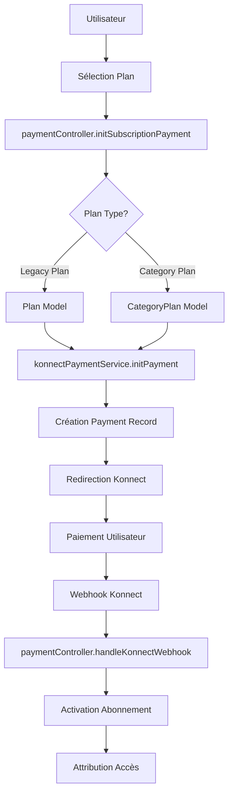
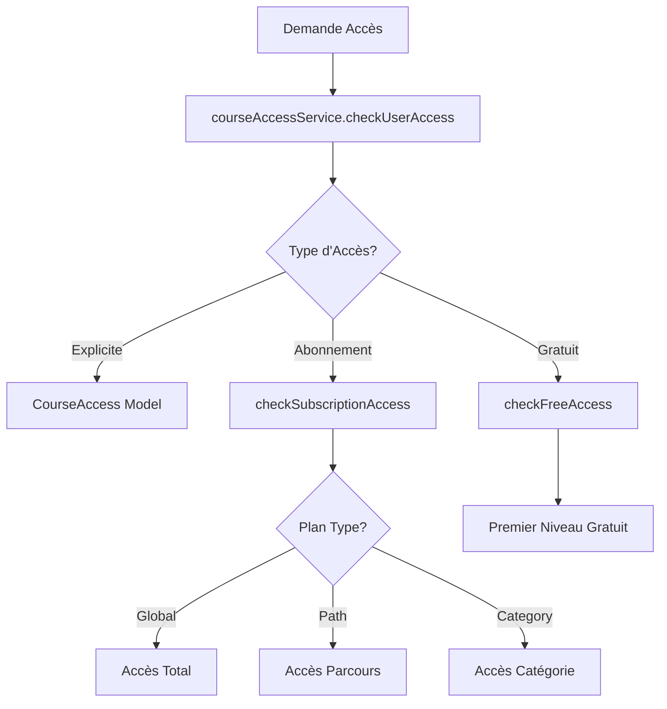

# Analyse Complète du Système de Paiement et d'Abonnement

## 📋 Résumé Exécutif

Le système de paiement et d'abonnement de CodeGenesis présente une architecture complexe avec plusieurs systèmes parallèles qui nécessitent une consolidation. L'analyse révèle des points forts dans l'intégration Konnect et la gestion des accès, mais aussi des incohérences et des opportunités d'amélioration significatives.

## 🏗️ Architecture Actuelle

### 1. Modèles de Données

#### **Payment.js** - Gestion des Transactions
- **Points Forts** :
  - Structure complète avec statuts détaillés
  - Intégration Konnect robuste
  - Gestion des webhooks et notifications
  - Auto-expiration des paiements en attente (24h)

- **Points d'Amélioration** :
  - Redondance avec le modèle Subscription
  - Logique métier mélangée dans le modèle

#### **Subscription.js** - Gestion des Abonnements
- **Points Forts** :
  - Statuts d'abonnement complets
  - Historique des paiements intégré
  - Gestion des accès accordés
  - Méthodes d'annulation et reprise

- **Points d'Amélioration** :
  - Duplication avec le champ `subscription` dans User
  - Logique de renouvellement automatique incomplète

#### **Plan.js** - Plans d'Abonnement
- **Points Forts** :
  - Structure simple et claire
  - Support multi-devises
  - Gestion des fonctionnalités

- **Points d'Amélioration** :
  - Manque de types de plans (global, path, category)
  - Pas de gestion des prix annuels

#### **CategoryPlan.js** - Plans par Catégorie
- **Points Forts** :
  - Support multilingue complet
  - Types de paiement flexibles (one_time, monthly, yearly)
  - Gestion des durées d'accès

- **Points d'Amélioration** :
  - Séparation avec le système Plan principal
  - Logique de prix en centimes vs dinars

### 2. Contrôleurs

#### **paymentController.js** - Contrôleur Principal
- **Fonctionnalités** :
  - Initialisation des paiements (legacy + CategoryPlan)
  - Gestion des webhooks Konnect
  - Activation des abonnements
  - Attribution des accès

- **Problèmes Identifiés** :
  - Logique complexe avec fallback entre systèmes
  - Gestion des utilisateurs non authentifiés (mode test)
  - Duplication de code avec subscriptionController

#### **subscriptionController.js** - Contrôleur Legacy
- **Fonctionnalités** :
  - Souscription aux plans
  - Gestion des abonnements utilisateur
  - Changement et annulation de plans

- **Problèmes Identifiés** :
  - Utilise le champ `subscription` dans User au lieu du modèle Subscription
  - Logique de paiement intégrée
  - Pas de gestion des webhooks

#### **categoryPaymentController.js** - Contrôleur Catégories
- **Fonctionnalités** :
  - Gestion des plans de catégories
  - Paiements par catégorie
  - Déblocage de niveaux
  - Historique des accès

- **Points Forts** :
  - Architecture propre et séparée
  - Gestion complète du cycle de vie

### 3. Services

#### **konnectPaymentService.js** - Service Konnect Principal
- **Points Forts** :
  - Configuration robuste avec validation
  - Gestion d'erreurs complète
  - Support des webhooks
  - Logging détaillé

- **Fonctionnalités** :
  - Initialisation des paiements
  - Vérification des statuts
  - Traitement des webhooks
  - Création d'URLs de paiement direct

#### **konnectService.js** - Service Legacy
- **Problèmes** :
  - Duplication avec konnectPaymentService
  - Support SDK optionnel non utilisé
  - Logique de fallback complexe

#### **categoryPaymentService.js** - Service Catégories
- **Points Forts** :
  - Logique métier complète
  - Intégration avec LevelUnlockService
  - Gestion des accès gratuits
  - Nettoyage automatique

#### **levelUnlockService.js** - Service de Déblocage
- **Points Forts** :
  - Déblocage automatique des niveaux
  - Intégration avec la progression
  - Gestion des premiers niveaux gratuits

### 4. Routes et Middlewares

#### **Routes de Paiement**
- **paymentRoutes.js** : Routes principales avec auth optionnelle
- **subscriptionRoutes.js** : Routes legacy avec auth requise
- **subscriptionPayment.js** : Routes de paiement d'abonnement
- **categoryPaymentRoutes.js** : Routes spécialisées catégories

#### **Middlewares**
- **subscriptionMiddleware.js** : Vérification des abonnements
- **authMiddleware.js** : Authentification
- **webhook.js** : Gestion des webhooks Konnect

## 🔍 Analyse des Flux

### 1. Flux de Paiement Standard



### 2. Flux de Gestion des Accès



## ⚠️ Problèmes Identifiés

### 1. **Duplication et Incohérence**
- **Deux systèmes de plans** : `Plan` (legacy) vs `CategoryPlan` (nouveau)
- **Deux modèles d'abonnement** : `Subscription` vs `User.subscription`
- **Deux services Konnect** : `konnectPaymentService` vs `konnectService`
- **Logique de prix** : centimes vs dinars selon le contexte

### 2. **Complexité de Maintenance**
- **Fallback logic** complexe dans paymentController
- **Mode test** intégré dans la logique de production
- **Gestion des erreurs** incohérente entre contrôleurs

### 3. **Sécurité et Validation**
- **Webhooks** sans vérification de signature
- **Authentification optionnelle** sur certaines routes critiques
- **Validation des données** insuffisante

### 4. **Performance**
- **Requêtes multiples** pour vérifier les accès
- **Pas de cache** pour les vérifications d'abonnement
- **Index manquants** sur certaines requêtes fréquentes

## 🎯 Recommandations

### 1. **Consolidation Immédiate**

#### **Unifier les Modèles de Plans**
```javascript
// Nouveau modèle Plan unifié
const planSchema = new mongoose.Schema({
  _id: { type: String, required: true },
  name: { type: String, required: true },
  type: { type: String, enum: ['global', 'path', 'category'], required: true },
  targetId: { type: mongoose.Schema.Types.ObjectId }, // Pour path/category
  price: { type: Number, required: true }, // En centimes
  currency: { type: String, default: 'TND' },
  interval: { type: String, enum: ['month', 'year', 'one_time'] },
  accessDuration: { type: Number }, // Pour one_time
  translations: { /* Support multilingue */ },
  features: [String],
  active: { type: Boolean, default: true }
});
```

#### **Consolider les Services Konnect**
- Supprimer `konnectService.js`
- Utiliser uniquement `konnectPaymentService.js`
- Ajouter la vérification de signature des webhooks

### 2. **Amélioration de l'Architecture**

#### **Service de Paiement Unifié**
```javascript
class UnifiedPaymentService {
  static async initPayment(planId, userId, options = {}) {
    // Logique unifiée pour tous les types de plans
  }
  
  static async processWebhook(paymentRef) {
    // Traitement unifié des webhooks
  }
  
  static async activateAccess(payment) {
    // Activation unifiée des accès
  }
}
```

#### **Middleware d'Accès Optimisé**
```javascript
const accessMiddleware = {
  requireAccess: (contentType) => async (req, res, next) => {
    // Vérification d'accès optimisée avec cache
  },
  
  requireSubscription: async (req, res, next) => {
    // Vérification d'abonnement avec cache
  }
};
```

### 3. **Sécurité Renforcée**

#### **Validation des Webhooks**
```javascript
const verifyKonnectSignature = (req, res, next) => {
  const signature = req.headers['x-konnect-signature'];
  const payload = JSON.stringify(req.body);
  
  if (!verifySignature(signature, payload, process.env.KONNECT_WEBHOOK_SECRET)) {
    return res.status(401).json({ error: 'Invalid signature' });
  }
  
  next();
};
```

#### **Validation des Données**
```javascript
const paymentValidation = {
  initPayment: [
    body('planId').isMongoId().withMessage('Plan ID invalide'),
    body('customerEmail').isEmail().withMessage('Email invalide'),
    body('amount').isInt({ min: 1 }).withMessage('Montant invalide')
  ]
};
```

### 4. **Performance et Monitoring**

#### **Cache Redis**
```javascript
const cacheService = {
  getUserAccess: async (userId) => {
    const cached = await redis.get(`access:${userId}`);
    if (cached) return JSON.parse(cached);
    
    const access = await calculateUserAccess(userId);
    await redis.setex(`access:${userId}`, 300, JSON.stringify(access));
    return access;
  }
};
```

#### **Monitoring et Logs**
```javascript
const paymentLogger = {
  logPayment: (event, data) => {
    console.log(`[PAYMENT] ${event}:`, {
      timestamp: new Date().toISOString(),
      userId: data.userId,
      amount: data.amount,
      status: data.status,
      ...data
    });
  }
};
```

### 5. **Tests et Documentation**

#### **Tests Unitaires**
- Tests pour tous les services de paiement
- Tests de validation des webhooks
- Tests de gestion des erreurs

#### **Tests d'Intégration**
- Tests end-to-end des flux de paiement
- Tests de compatibilité Konnect
- Tests de performance

## 📊 Plan de Migration

### **Phase 1 : Consolidation (2-3 semaines)**
1. Créer le modèle Plan unifié
2. Migrer les données existantes
3. Unifier les services Konnect
4. Mettre à jour les contrôleurs

### **Phase 2 : Sécurité (1-2 semaines)**
1. Ajouter la validation des webhooks
2. Renforcer l'authentification
3. Implémenter la validation des données
4. Ajouter les logs de sécurité

### **Phase 3 : Performance (1-2 semaines)**
1. Implémenter le cache Redis
2. Optimiser les requêtes
3. Ajouter les index manquants
4. Implémenter le monitoring

### **Phase 4 : Tests et Documentation (1 semaine)**
1. Tests unitaires et d'intégration
2. Documentation API
3. Guide de déploiement
4. Formation équipe

## 🎯 Métriques de Succès

### **Performance**
- Temps de réponse < 200ms pour les vérifications d'accès
- Réduction de 50% des requêtes DB
- Cache hit rate > 80%

### **Sécurité**
- 0 vulnérabilité de sécurité
- 100% des webhooks validés
- Logs complets de toutes les transactions

### **Maintenabilité**
- Réduction de 70% de la duplication de code
- Tests de couverture > 90%
- Documentation complète

## 🔧 Outils Recommandés

### **Monitoring**
- **New Relic** ou **DataDog** pour le monitoring
- **Sentry** pour la gestion des erreurs
- **Redis** pour le cache

### **Tests**
- **Jest** pour les tests unitaires
- **Supertest** pour les tests d'API
- **Cypress** pour les tests E2E

### **Documentation**
- **Swagger/OpenAPI** pour la documentation API
- **Postman** pour les collections de tests
- **Confluence** pour la documentation technique

## 📝 Conclusion

Le système de paiement et d'abonnement de CodeGenesis présente une base solide mais nécessite une consolidation importante pour améliorer la maintenabilité, la sécurité et les performances. Les recommandations proposées permettront de créer un système unifié, sécurisé et performant qui facilitera la maintenance et l'évolution future.

La priorité doit être donnée à la consolidation des modèles et services, suivie par le renforcement de la sécurité et l'optimisation des performances. Cette approche progressive minimisera les risques tout en apportant des améliorations significatives.
